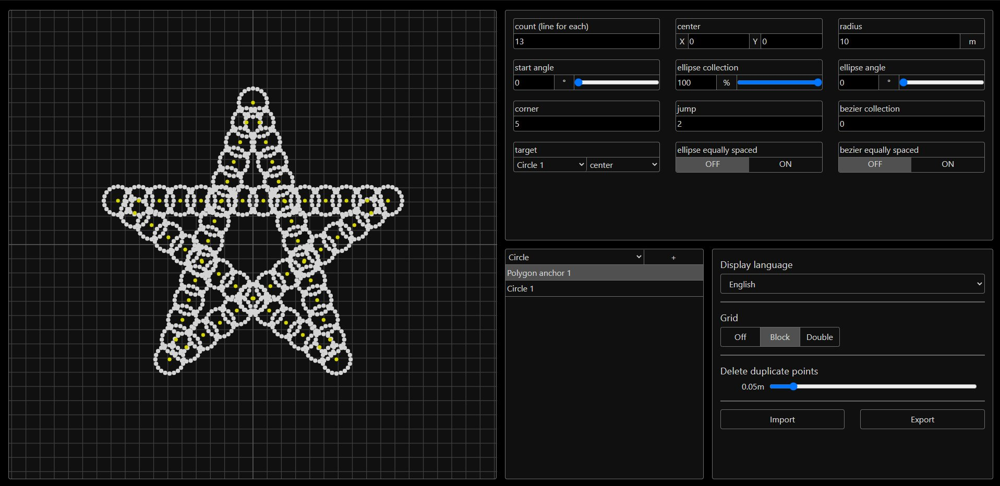

# [Shapes Generator](https://ChenCMD.github.io/Shapes-Generator/)
静的なパーティクルコマンドで構成されたmcfunctionファイルを生成することができるジェネレーター

A generator that can generate mcfunction files consisting of static particle commands.

## 対応している言語 / Supported languages
* 日本語
* English

## 貢献 / Contributes
このジェネレーターにバグやリクエストがある場合、[Issueを開いて](https://github.com/ChenCMD/Shapes-Generator/issues/new)それを私たちに共有してください！  
また、一つのIssueには一つのバグ/アイディアのみを入れ、バグの場合は再現や修正に有用な情報を入れて作成してくれるととても助かります！

If you have any bugs or requests for this generator, please [open an Issue](https://github.com/ChenCMD/Shapes-Generator/issues/new) and share it with us!  
Also, it would be very helpful if you could create one Issue with only one bug/idea in it, and in the case of bugs, with useful information to reproduce or fix!